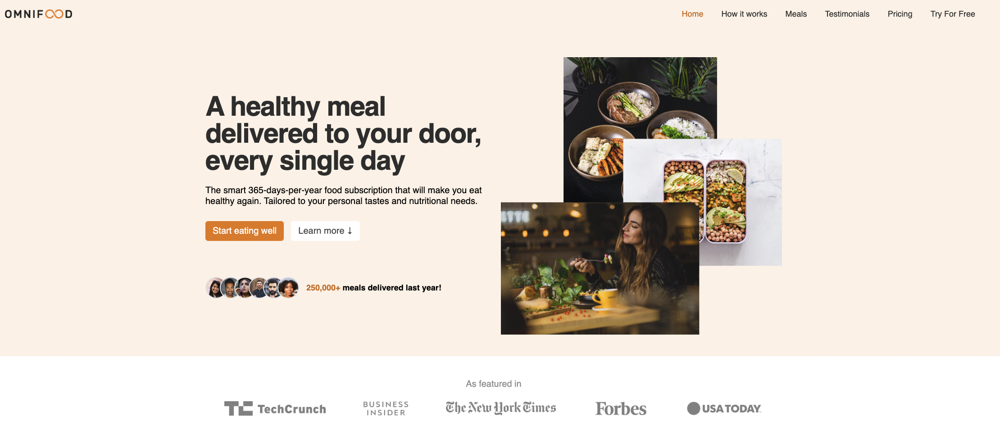
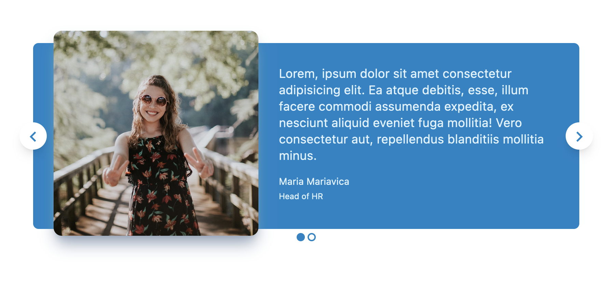
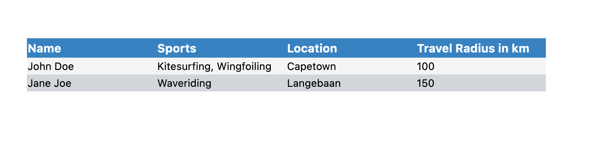
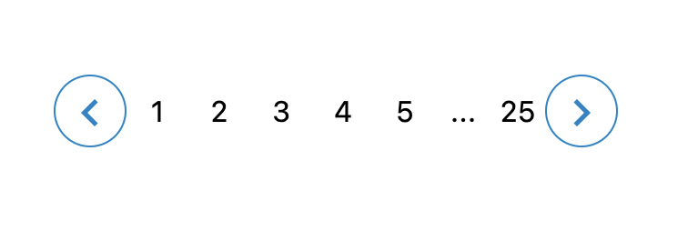
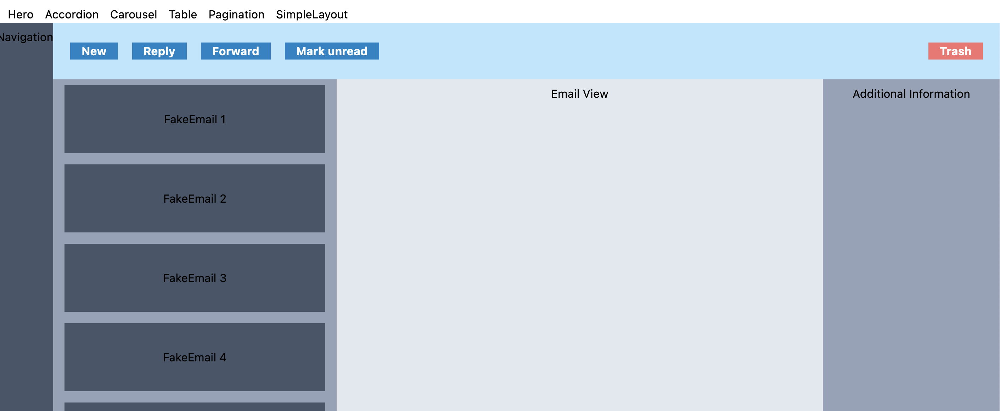

# HTML and CSS Knowledge and Notes

[Important Design Rules](./designRules.md)

[7 Steps to a great Website](./steps.md)

## Omnifood Project



This project is based on the "Build Responsive Real-World Websites with HTML and CSS" course by Jonas Schmedtmann.
To learn frontend development I adapted the project that it is completely build with Vue and TailwindCSS.

It is a plain Single Page Application without any Backend functionality, and not the peak of software engineering.

The main goal of this project for me was to build a modern website while learning new technologies.
To checkout the whole website execute following steps:

1. clone this repository

```bash
    git clone https://github.com/fgeck/html-css-good2know.git
```

2. change into omnifood-project directory

```bash
cd omnifood-project
```

3. install dependencies

```bash
    npm install
```

4. run the application

```bash
    npm run dev
```

5. navigate to http://localhost:5173/

[Click Here to see the source code](./omnifood-project/)

### Open Todos

- responsive for mobile devices
- on SPA navigation with effects

------------

## Reusable Vue Components created with Vue and TailwindCSS

### Accordion


[file](components/vue/src/components/Accordion.vue)

------------

### Carousel


[file](components/vue/src/components/Carousel.vue)

------------

### Table


[file](components/vue/src/views/Table.vue)

------------

### Pagination

!! Needs some rework:
- dynamically change displayed pages
- re-render on change


[file](components/vue/src/views/PaginatnionView.vue)

------------

### Hero Section


[file](components/vue/src/views/HeroView.vue)

------------

### Email App Layout (just for training purposes)


[file](components/vue/src/views/EmailAppLayoutView.vue)
